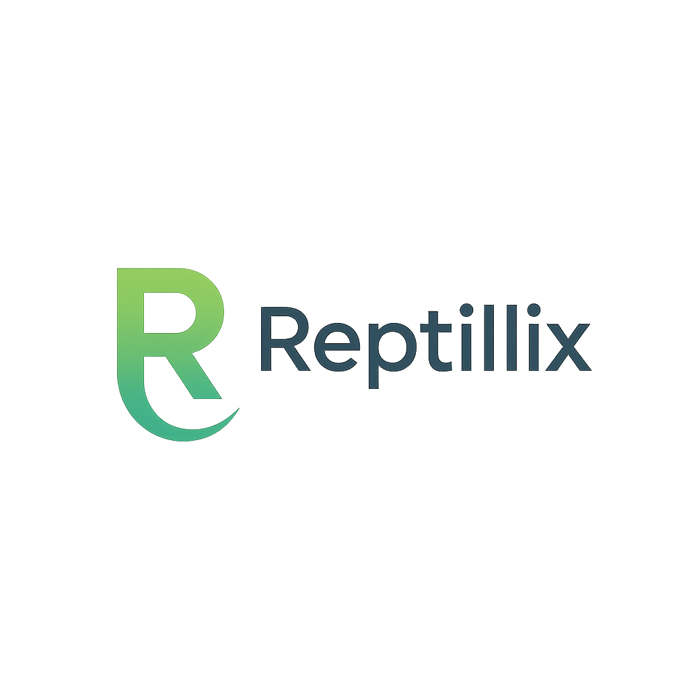

<!-- .github/README.md — Reptillix organization profile -->

  

  <strong>Digital marketing &amp; software agency</strong> 
  UX/UI · AI-powered automation · SEO &amp; PPC · DevOps &amp; Cloud

---

### 🚀 What we do
- **Full-stack development** – web & mobile apps, APIs, integrations  
- **UX · UI · Branding** – research-driven design that converts  
- **AI-powered automation** – Harness the power of Advanced Cloud Infrastructure  
- **Growth marketing** – data-driven SEO, PPC & CRO campaigns  
- **DevOps** – Advanced, cloud-base CI/CD solutions 

### 🧰 Tech toolbox
---

### 📊 GitHub snapshot
---
<!-- Stats work on a *user*; keeping reptillix-admin for now -->

*Numbers reflect public activity; private client code stays private.*

### 👥 Meet the team
---
| &nbsp; | &nbsp; |
| :-: | :- |
|  | **Aviv Ozeri** – Full-Stack Developer |
|  | **Yuval Baki** – Forntend Developer & Marketing |
|  | **Gal Rozman** – DevOps Engineer |

### 📬 Connect
---

---

  © 2025 Reptillix

